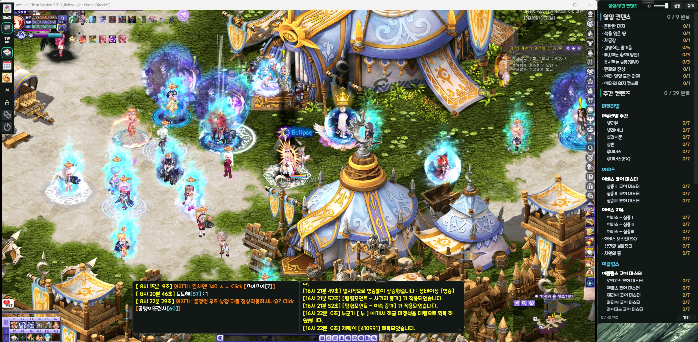
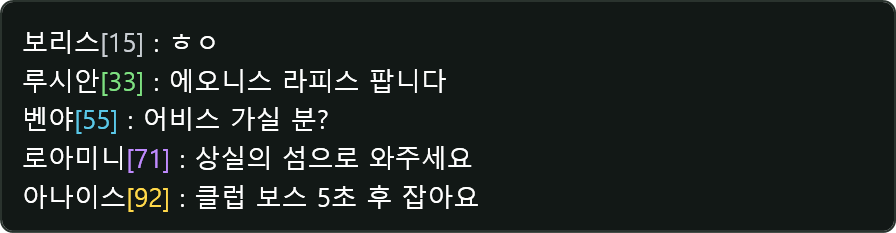
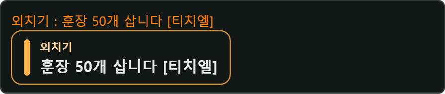
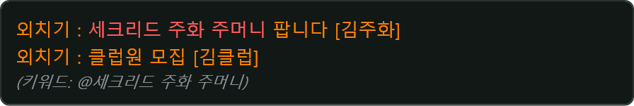
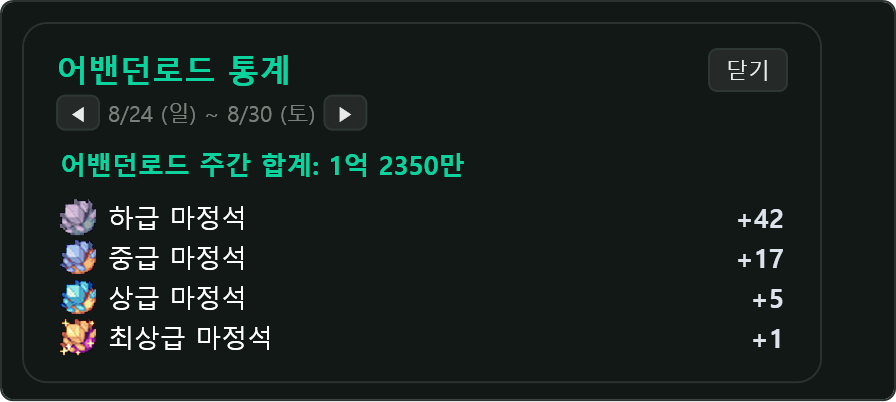
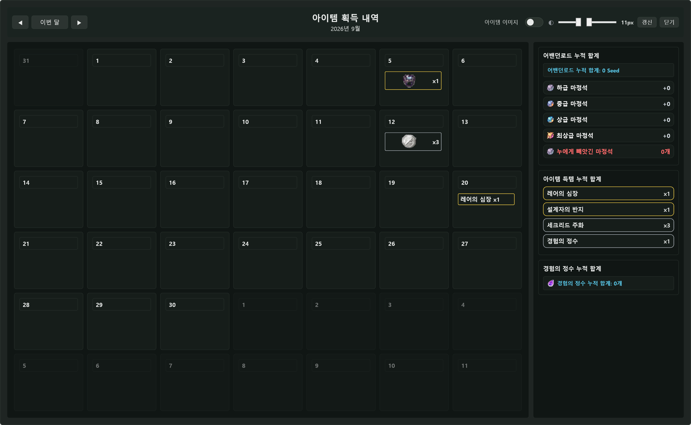
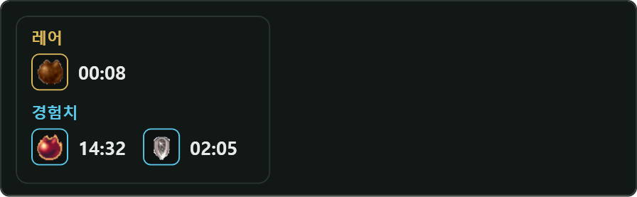
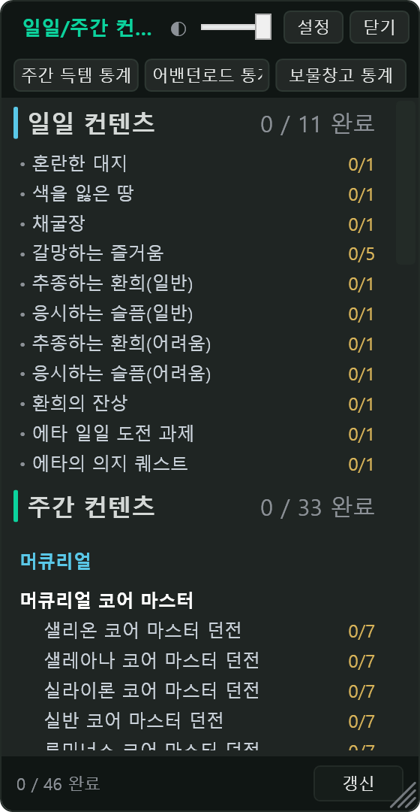
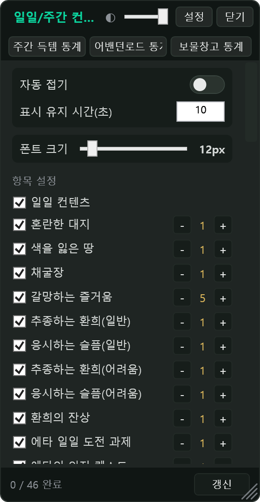

# TWChatOverlay

**테일즈위버 채팅 로그 기반의 보조 프로그램** — 실시간 채팅 로그 분석으로 인게임에서 놓치기 쉬운 정보를 오버레이로 제공합니다.

게임 메모리를 건드리지 않고, 게임이 직접 생성하는 텍스트 로그 파일만 읽습니다.

---

## 주요 기능

### 채팅창 오버레이
* **채팅 필터 & 색상** — 일반/팀/클럽/외치기/시스템 종류별 표시 여부와 색상 지정
* **말머리** — 각 줄 앞에 `[일반]` `[팀]` `[클럽]` `[외치기]` `[시스템]` 표기, 외치기는 `[외치기] 보낸이 : 내용`으로 재구성

  

* **에타 레벨 표시** — 채팅 유저의 에타 레벨을 실시간 표기, 레벨 구간별 색상 지원

  

* **서브 채팅창** — 메인과 별도로 최대 2개, 탭별(일반/팀/클럽/외치기/시스템/아이템) 전용 창 구성 가능

### 외치기
* **외치기 팝업** — 외치기 발생 시 토스트 알림, 유지 시간·텍스트 크기 조절

  

* **닉네임 자동복사** — 외치기 끝의 `[닉네임]`을 클립보드로 자동 복사
* **외치기 다시 보기** — 놓친 외치기를 메뉴에서 다시 확인

### 키워드 알림
* 지정 키워드가 채팅에 등장하면 색상 강조 + 알림음

  

### 경험치 추적
* **실시간 추적** — 누적 경험치 / 시간당 효율 / 최근 획득량 표시

  

* **누적 경험치 알림** — '경험의 정수' 교환 후 목표 누적치 도달 시 알림 (이벤트·퀘스트 경험치는 인식되지 않을 수 있음)

  

* **저효율 알림** — 기준치 이하 경험치 획득 시 음성 알림

### 던전 도우미
* **에토스 방향 알림** — 이클립스 에토스의 방향 표시

  

* **던전 카운터** — 어밴던로드 진행 단계, 갈망하는 즐거움 에너지량 표시

  

* **어밴던로드 통계** — 주간 수익(마정석 등) 집계 창

  

* **웨이브 종료 알림** — 룬 경험치 던전, 테시스 코어 던전 웨이브 종료 알림음
* **반사 패턴 알림** — 어비스 2사도 반사 패턴 알림음
* **보급품 탈환 지도** — 보급품 위치 참고용 지도 창

### 아이템 획득 알림
* 레어 아이템 획득 시 토스트 알림 + 사운드

  

* **아이템 필터** — 기본 필터에 원하는 아이템을 추가/제거, 필터 저장·불러오기 지원
* **수익 월별 통계** — 획득 아이템·마정석·경험의 정수를 월별 달력으로 집계

  

### 버프 추적 (참고용)
* 버프 시작을 감지해 남은 시간 표시, 종료 시 사운드 알림

  

* 로그상 '시작' 시점만 감지 가능 — 종료 시점을 확인할 수 없는 버프는 참고용
* 지원 버프: 마법의 눈 · 경험의 심장 · 클럽 포인트 스크롤 · 경험치 캐시 3종 · 레어의 심장 · 로토의 부적

### 필드 보스 알림
* 아칸 · 스페르첸드 · 파멸의 기원 · 혼란한 대지 등 등장 3분 전 / 1분 전 / 직전 알림 (팝업 + 사운드)

  

### 일일/주간 컨텐츠 추적
* 일일/주간 숙제 완료 여부를 로그에서 자동 체크하는 체크리스트 오버레이 (왼쪽: 일반, 오른쪽: 설정)

  

    
    
  

### TW DB (웹)
에타 순위표·검색, 계산기·시뮬레이터, 장비 DB·제작 재료는 웹으로 이관되었습니다.
→ **https://talesdb.xyz/#/extra**

---

## 시작하기

### 1. 설치 및 실행
1. **Releases** 페이지에서 최신 버전 `.zip`을 다운로드합니다.
2. 적당한 폴더에 압축을 해제합니다.
3. 테일즈위버에서 **설정 → 게임 → 채팅 로그 → ON**으로 변경합니다.
4. `TWChatOverlay.exe`를 실행합니다.

### 2. 설정 마법사
최초 실행 시 설정 마법사가 열립니다.
1. **채팅 로그 위치 설정** — 테일즈위버의 `ChatLog` 폴더를 지정합니다. (예: `C:\Nexon\TalesWeaver\ChatLog`)
2. **채팅창 ~ 필드 보스 설정** — 실제 설정 화면과 동일한 패널이 단계별로 나옵니다. 여기서 바꾼 값은 그대로 저장됩니다.
3. **일일/주간 컨텐츠 추적 설정** — 체크리스트에 표시할 항목을 고릅니다.

마법사는 언제든 **설정**에서 다시 실행할 수 있고, 건너뛰어도 기본값으로 바로 사용할 수 있습니다.

### 3. 창 위치·크기 조정 (잠금 해제 모드)
* 메뉴의 **잠금 해제**를 켜면 모든 오버레이 창을 드래그로 이동, 모서리로 크기 조절할 수 있습니다.
* 설정의 각 추가 기능 탭에 들어가면 해당(활성화된) 창의 위치 미리보기가 표시됩니다.

### 4. 프로필
* **설정 → 프로필**에서 현재 설정 전체를 프로필로 저장하고 언제든 되돌릴 수 있습니다.
* 프로필을 파일로 내보내 다른 PC로 옮기거나, 파일에서 불러올 수 있습니다.

---

## Q&A

* **Q) 채팅 로그가 나타나지 않아요**
  - 게임 설정에서 채팅 로그가 ON인지 확인 → 앱 **설정 → 시스템**의 로그 경로를 실제 테일즈위버 `ChatLog` 폴더로 지정
* **Q) 폰트를 바꾸고 싶어요**
  - **설정 → 채팅 표시**의 글꼴에서 번들 폰트(쿠키런/프리텐다드/나눔스퀘어라운드/G마켓 산스 등)를 선택
  - 다른 폰트를 쓰려면 실행 파일 위치의 `Font` 폴더에 원하는 폰트를 `UserDefine.ttf`로 넣고 글꼴을 `사용자 설정`으로 선택
* **Q) 원하는 채팅만 보고 싶어요**
  - **설정 → 채팅 필터**에서 원하는 종류만 체크하면 기본 탭에 해당 채팅만 표기
* **Q) 설정 항목이 무슨 기능인지 모르겠어요**
  - 각 설정 항목 옆의 `[?]` 버튼을 누르면 실제 화면 예시와 설명이 나옵니다.

---

## 리소스 사용량

| 상태 | CPU (1코어 기준) | 메모리 (작업관리자 기준) |
|---|---|---|
| 평상시 | 1% 미만 | 약 150~170MB |
| 채팅 폭주 (초당 10줄) | 약 26% | 약 130MB |
| 채팅 폭주 (초당 30줄) | 약 45% | 약 150MB |
| 최초 실행 직후 | 1코어 사용 (수 분) | 약 150MB |

- 최초 실행(또는 5.0 업그레이드) 직후에는 과거 채팅 로그를 분석해 아카이브를 구축하느라 잠시 CPU를 사용하며, 완료되면 위 평상시 수준으로 돌아옵니다.
- Windows 11 · 16코어 환경, Release 빌드 실측 기준 (CPU는 프로세스 CPU 시간 60초 샘플링)

---

## 주의 사항
* **데이터 방식** — 메모리를 변조하지 않으며, 게임이 생성하는 텍스트 로그 파일만 읽습니다.
* **디스플레이** — 오버레이는 **창 모드**에 최적화되어 있습니다. 전체화면 모드에서는 오버레이가 보이지 않을 수 있습니다.

---

## 기술 스택
* **Language**: C#
* **Framework**: WPF (.NET 8)

---

## 라이선스
This project is licensed under the MIT License
